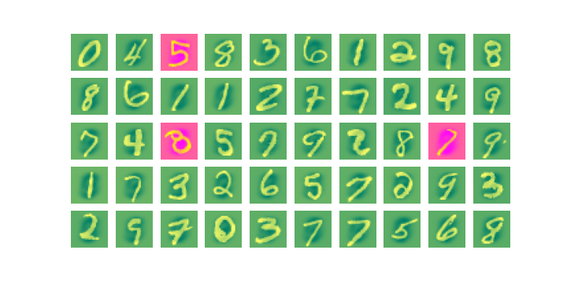

    

<h1 align="center">MNIST Handwritten Digits: A Simple ANN Classifier</h1>

  
  
  

---

A (hopefully) well-structured and easy to understand Jupyter notebook outlining some machine-learning basics with the help of a self-written adjustable *neural network* using purely the power of the brilliant [NumPy](https://numpy.org/) module. I originally decided against using any mainstream machine-learning modules such as [TensorFlow](https://github.com/tensorflow/tensorflow), [PyTorch](https://github.com/pytorch/pytorch), [Caffe](https://github.com/BVLC/caffe), etc. in order to acquire a *deeper understanding* about the mathematics and tech behind deep neural networks.

> Check out the notebook **[here](main.ipynb)!**

## 🔍 Want More?

Some of my other machine-learning repositories that I might do a makeover on soon as well. For references to other (perhaps more interesting) reads, check out the articles I linked to every now and then in the notebook.

- [ConvNet - MNIST Dataset](https://github.com/MattMoony/convnet_mnist) [2019] ... Using a *convolutional neural network* to classify handwritten digits
- [RNN (LSTM) - Goethe Texts](https://github.com/MattMoony/rnn-lstm_goethe-generation) [2019] ... Using a *recurrent neural network* (*long short term memory*) to generate characters in a "Goethe-like" manner
- [ConvNet - Style Transer](https://github.com/MattMoony/convnet_style-transfer) [2019] ... Using PyTorch and the *VGG16* network to transfer artists' styles onto digital images
- [ConvNet - Deep Dream](https://github.com/MattMoony/convnet_deep-dream) [2019] ... Using PyTorch and *GoogLeNet* to generate mind-blowing images using a neural network's "imagination"

---

... Matthias Monschein (September 2021)